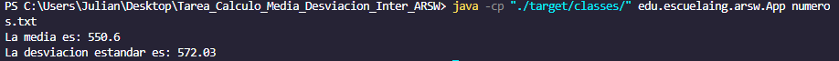
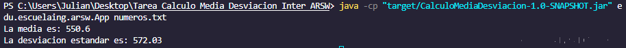
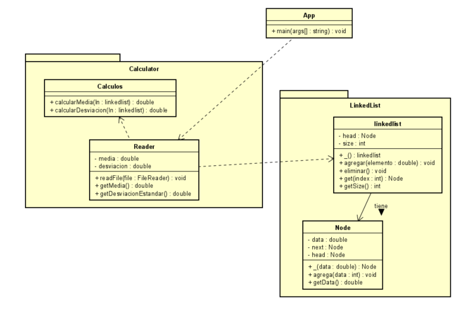

# Tarea 2 ARSW Inter (Calculo Media y desviacion con LinkedList)

## Realizado por Julian Adolfo Peña Marin

El programa es una implementacion de una calculadora que calcula la media y la desviacion estandar de un conjunto de datos, que estan guardados en un archuivo y que el programa lee directamente del archivo. Para realizar los calculos, los datos se guardan en una implementacion de una linkedList.

## Documentación

Para obtener la documentacion se puede utilizar el siguiente comando para generarla

```
    mvn javadoc:javadoc
```
## Como Correrlo
Primero se debe clonar el repositorio, para esto puede utilizar el siguiente comando de git, con la url del repositorio que se quiere clonar, como se muestra a continuación

```
    git clone https://github.com/JulianP-24/Tarea_Calculo_Media_Desviacion_Inter_ARSW.git
```

Una vez clonado para empezar a ejecutarlo ponga el siguiente comando

```
    mvn package
```

Despues puede correrlo con el siguiente comando, ubicandose en la carpeta raiz, en este caso se lee del archivo con nombre numeros.txt

```
    java -cp "./target/classes/" edu.escuelaing.arsw.App numeros.txt
```


Otra forma pra correrlo, ya generado el JAR, es con el siguiente comando

```
    java -cp "target/CalculoMediaDesviacion-1.0-SNAPSHOT.jar" edu.escuelaing.arsw.App numeros.txt
```


## Diagrama de Clase
A continuacion se muestra el diagrama de clases correspondiente con la aplicacion



En el diagrama de clases se obseravn5 clases, distribuidas en dos paquetes respectivamente, los paquetes tienen como nombre calculator, que es en donde se lee el archivo y se realizan los calculos correspondientes, dentro de este paquete, hay dos clases las cuales son: la clase reader que tiene el metodo para leer el archivo y la clase calculos que tiene los metodos para calcular la media y la desviacion estandar.

El otro paquete se llama LinkedList que es en donde se hace la implementacion de la estructura de datos. Dentro se tienen dos clases: una es la clase Node, en donde se crean los nodos de la linkedlist respectivamente y la otra clase se llama linkedlist que es ya como tal donde se crea la lista, utilizando los nodos y los datos leidos del archivo, haciendo uso de los metodos respectivos.

La clase principal App en el metodo main llama a la clase reades para leer el archivo, esa clase reader llama a calculos para realizar las operaciones e igualmente hace uso de la clase linkedlist para la implementacio que esta a su vez hace uso de la clase Node.
